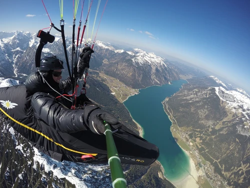

![[release]](https://github.com/naschidaniel/image-optimizer/actions/workflows/release.yml/badge.svg) 
![[rsaudit]](https://github.com/naschidaniel/image-optimizer/actions/workflows/rsaudit.yml/badge.svg?name=rsaudit) 
![[rstest]](https://github.com/naschidaniel/image-optimizer/actions/workflows/rstest.yml/badge.svg?name=rstest)

# image-optimizer

A small tool to optimise images for web applications. The tool is written in Rust. 

## Get the latest release of the image-optimizer

The required binary for the platform can be downloaded from [Releases: Main](https://github.com/naschidaniel/image-optimizer/releases/tag/main).

```
# Linux 
curl -L https://github.com/naschidaniel/image-optimizer/releases/download/main/image-optimizer-linux --output image-optimizer && chmod +x image-optimizer

# Windows
curl -L https://github.com/naschidaniel/image-optimizer/releases/download/main/image-optimizer.exe --output image-optimizer.exe

# MacOs
curl -L https://github.com/naschidaniel/image-optimizer/releases/download/main/image-optimizer-macos --output image-optimizer && chmod +x image-optimizer
```

The following command line arguments are required: {inputfolder} {outputfolder} {sufix} {width} {quality} {webpimage}.

```
# Optimize images and create WebP Image
./image-optimizer ./media ./testdata sm 500 90 true

# Optimize images only
./image-optimizer ./media ./testdata sm 500 90 false
```

The command has optimised all `*.jpg` and `*.png` files in the `./media` folder. In this example, the file `./testdata/paradise/fly_sm.JPG` was created with the width of `500 px` and the quality of `90`. With the additional command line argument {webpimage == `true`}, the optimised images can be saved in [WebP](https://developers.google.com/speed/webp) image format.

## Development

```
cargo test
# or
cargo run ./media ./testdata sm 500 90 true
```
## Testdata

### Original File

- Width: 4000 px
- Hight: 3000 px
- Size: 2,3 MB


### Optimized Files

#### Converted JPG File
- Width: 500 px
- Hight: 375 px
- Size: 75,6 kb


#### Converted WebP File
- Width: 500 px
- Hight: 375 px
- Size: 54,8 kb




## Build

```
cargo build --release --all-features
```

## Changelog

* 2021-09-09 A copy of the resized file is saved in [WebP](https://developers.google.com/speed/webp) format.
* 2021-06-07 Init Repository

## License

[GPL-3.0](./LICENSE)

Copyright (c) 2021-present, Daniel Naschberger