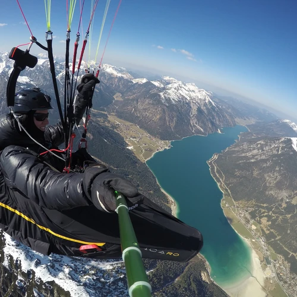

[](https://github.com/naschidaniel/image-optimizer/actions/workflows/release.yml)
[](https://github.com/naschidaniel/image-optimizer/actions/workflows/rsaudit.yml)
[](https://github.com/naschidaniel/image-optimizer/actions/workflows/rsbuild.yml)
[](https://github.com/naschidaniel/image-optimizer/actions/workflows/rsformat.yml)
[](https://github.com/naschidaniel/image-optimizer/actions/workflows/rstest.yml)

# image-optimizer

A small tool to optimise images JPEG and PNG images for web applications. The images are scaled in keeping with the aspect ratio. In addition a copy in WebP format and a thumbnail with a aspect ration 1:1 can be created.
The tool is written in Rust. 

## Get the latest release of the image-optimizer

The required binary for the platform can be downloaded from [Releases: latest](https://github.com/naschidaniel/image-optimizer/releases/latest).

```
# Linux 
curl -L https://github.com/naschidaniel/image-optimizer/releases/latest/download/image-optimizer-linux --output image-optimizer && chmod +x image-optimizer
./image-optimizer --version

# MacOs
curl -L https://github.com/naschidaniel/image-optimizer/releases/latest/download/image-optimizer-macos --output image-optimizer && chmod +x image-optimizer
./image-optimizer --version

# Windows
curl -L https://github.com/naschidaniel/image-optimizer/releases/latest/download/image-optimizer.exe --output image-optimizer.exe
image-optimizer.exe --version

```

## Program Help
```
# Get help
./image-optimizer --help
```

The following command line arguments are required: {source} {destination} {widths} {qualities} {webpimage} {thumbnail} {prefix} {jsonfile}.

```
# Optimize images in a folder, save a copy of the image in WebP format and create a thumbnails of the images
./image-optimizer --source ./media --destination ./testdata --widths 250 500 --qualities 90 80 --webpimage true --thumbnail true --prefix /www/moon/ --jsonfile metadata.json
```

The command will optimize all `*.jpg` and `*.png` files in the `./media` folder. In the folder `./testdata`, the optimized images will be created with a widths of `250 px` and `500 px` with the qualities of `90` and `80` percent in JPEG, PNG and [WebP](https://developers.google.com/speed/webp) Format. A square image including the postfix `thumbnail` with a widths and height of `250px` and `500px` will be generated. This image can be used as a preview for an image gallery.
The file `./testdata/metadata.json` is created in addition to the images. The JSON file contains the metadata of the optimized images. The prefix `/www/moon/` is added to the filenames in the `./testdata/metadata.json`.
```
# Optimize one images, save a copy of the image in WebP format and create a thumbnails of the image
./image-optimizer --source ./media/paradise/fly.JPG --destination ./testdata --widths 250 --qualities 90 --webpimage true --thumbnail true
```

The command optimizes the image and creates a thumbnail and a copy in WebP format.


## Testdata

### Original File

- Width: 4000 px
- Hight: 3000 px
- Size: 2,3 MB


### Optimized Files

#### Converted JPG File
- Width: 500 px
- Hight: 375 px
- Size: 75,6 kb


#### Converted WebP File
- Width: 500 px
- Hight: 375 px
- Size: 54,8 kb


#### Converted Thumbnail in WebP Format
- Width: 500 px
- Hight: 500 px
- Size: 63,5 kb


## Development

```
cargo test
# or
cargo run -- --destination ./testdata --source ./media --thumbnail true --webpimage true --prefix /www/moon/ --qualities 90 80 --widths 250 500  --jsonfile metadata.json```
```

## Build

```
cargo build --release --all-features
```


## How To use the image-optimizer in Production

An example of automatic image optimisiation for continuous integration and production with the image-optimizer can be found in [https://github.com/naschidaniel/fly-tirol](https://github.com/naschidaniel/fly-tirol).

## Changelog

* 2022-07-09 Version 0.4.0 - Dump Metadata of images to a jsonfile. 
* 2022-07-09 Version 0.3.6 - Refact command line parser Clap. 
* 2021-10-28 Version 0.3.1 - Single images can now also be converted. 
* 2021-09-17 Version 0.3.0 - Clap is used to parse command line arguments.
* 2021-09-16 Version 0.2.2 - A square image section with the postfix thumbnail can be generated.
* 2021-09-09 Version 0.2.0 - A copy of the resized file is saved in [WebP](https://developers.google.com/speed/webp) format.
* 2021-06-07 Version 0.1.0 - Init Repository

## License

[GPL-3.0](./LICENSE)

Copyright (c) 2021-present, Daniel Naschberger